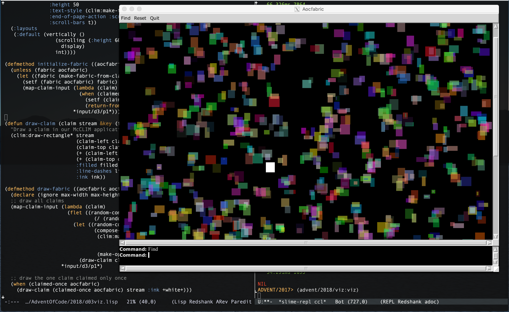

# Advent of Code

This repository contains my implementation of the [Advent of
Code](https://adventofcode.com/) puzzles, using Common Lisp. It's not that
I'm so proud that I want to share them, it's more like I'm having fun and I
might learn new tricks by exposing this code.

The intend of my playing of this game is to have fun and do the puzzles
quickly, mind you. I'm not going to extend any serious thoughs about
programming best practices here, so it will mostly show my own reflexes and
habits. Otherwise it's not fun anymore, is it?

## 2018

I prepared some tooling to output a summary of my puzzles timing and results
here, for interested readers having a quick overview. My intend is to keep
that up to data running it again each day.

I'm using [Clozure Common Lisp](https://ccl.clozure.com) Version 1.12-dev
DarwinX8664 for those hacks, it's known that SBCL might give a boost to the
results, or in other situations maybe ECL or clips would be even faster.
Should I care? well I certainly don't.

~~~
PARSER> (advent/2018:summary)
Day 1: Chronal Calibration
  Puzzle 1: sum of frequency changes
    3.958ms 520
  Puzzle 2: first frequency read twice
  699.040ms 394

Day 2: Inventory Management System
  Puzzle 1: checksum of box ids
    4.857ms 5000
  Puzzle 2: common letters in box ids one letter apart
    9.060ms ymdrchgpvwfloluktajxijsqmb

Day 3: No Matter How You Slice It
  Puzzle 1: find squares claimed more than once
  819.373ms 101565
  Puzzle 2: find the only claim asked of only once
  739.283ms 656
  
Day 4: Repose Record
  Puzzle 1: Most Sleepy Guard, Strategy 1
    5.472ms 35623
  Puzzle 2: Minute Most Slept by a single guard, Strategy 2
    7.761ms 23037
    
Day 5: Alchemical Reduction
  Puzzle 1: Polymer reactions
    2.609ms 10250
  Puzzle 2: Time to improve the polymer.
  100.259ms 6188
  
Day 6: Chronal Coordinates
  Puzzle 1: dangerous, keep away, largest finite area
  2132.732ms 4342
  Puzzle 2: safe, keep close, within manhattan sum threshold
  445.090ms 42966
~~~

## McCLIM visualization of Day 03 Fabrics puzzle

Just for the kicks of it, and because I'm nowadays playing around with
[McCLIM](https://common-lisp.net/project/mcclim/), A GUI toolkit for Common
Lisp, here's a visualization I did quickly in 64 lines of Common Lisp code
for the Fabrics puzzle:

## McCLIM visualization of Day 06 Chronal Coordinates puzzle

This time I had a bug where I would find the correct test result but fail to
find the correct result when given the input. That was quite puzzling me. I
decided I would draw the 2-D areas to get a clue. Oh, that's obvious now,
the bounding box computation is wrong. Fix this, recompute, good result!

Thanks McCLIM for making my life easy again ;-)

